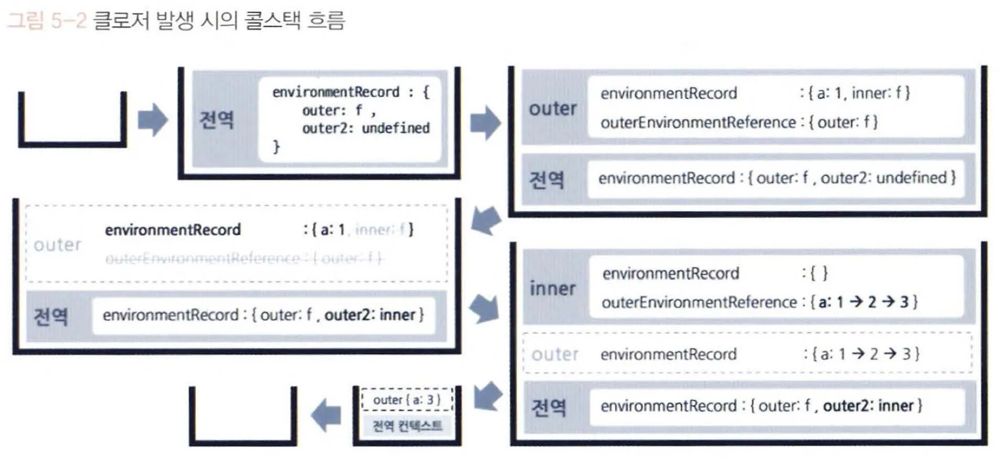
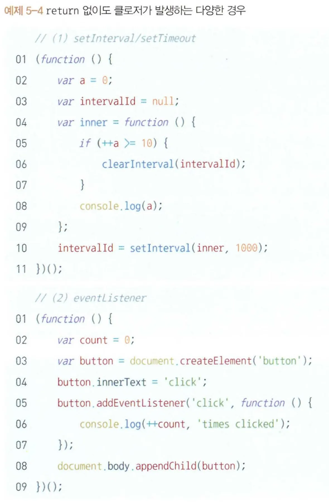

## 1. 클로저의 의미 및 원리 이해

### **클로저**

> 💡 어떤 함수에서 선언한 변수를 참조하는 내부함수를 외부로 전달할 경우, 함수의 실행 컨텍스트가 종료된 후에도 해당 변수가 사라지지 않는 현상

- 함수와 그 함수가 선언될 당시의 lexical environment의 상호관계에 따른 현상
  - ‘선언될 당시의 lexical environment’는 실행 컨텍스트의 구성 요소 중 하나인outerEnvironmentReference에 해당한다
- “어떤 함수에서 선언한 변수를 참조하는 내부 함수에서만 발생하는 현상”

---

### 클로저가 적용되지 않은 함수와 적용된 함수 예시

```javascript
// Ex. 5-2

var outer = function () {
  var a = 1;
  var inner = function () {
    return ++a;
  };
  return inner(); // 함수 실행 결과를 반환
};

var outer2 = outer();
console.log(outer2); // 2
```

- `inner()`으로 함수 실행 결과를 반환하고 있으므로 outer 함수의 실행 컨텍스트가 종료된 이후에는 a를 참조하는 대상이 없어진다(가비지 컬렉팅의 대상이 됨)

```javascript
// Ex. 5-3

var outer = function () {
  var a = 1;
  var inner = function () {
    return ++a;
  };
  return inner; // 함수 자체를 반환
};

var outer2 = outer();
console.log(outer2()); // 2
console.log(outer2()); // 3
```

- `inner` 함수 자체를 반환하므로 `outer2` 는 outer의 실행 결과인 inner을 참조한다
- inner 함수의 실행 컨텍스트의 environmentRecord에는 수집할 정보가 없다
- outer-EnvironmentReference에는 inner 함수가 선언된 위치의 LexicalEnvironment가 참조 복사된다
  - inner 함수는 outer 함수 내부에서 선언됐으므로, outer 함수의 LexicalEnvironment 가 담긴다
  - 이제 스코프 체이닝에 따라 outer에서 선언한 변수 a에 접근해서 1만큼 증가시킨 후 그 값인 2를 반환하고. inner 함수의 실행 컨텍스트가 종료된다

**이상한 점은 inner 함수의 실행 시점에는 outer 함수는 이미 실행이 종료된 상태인데, outer 함수의 LexicalEnvironment에 어떻게 접근할 수 있을까?**

- 이는 가비지 컬렉터의 동작 방식 때문인데, 가비지 컬렉터는 어떤 값을 참조하는 변수가 하나라도 있다면 그 값은 수집 대상에 포함시키지 않는다
- 예제 5-3의 outer 함수는 실행 종료 시점에 inner 함수를 반환했다. 외부 함수인 outer의 실행이 종료 되더라도 내부 함수인 inner 함수는 언젠가 outer2를 실행 함으로써 호출될 가능성이 열린 것이다
- 언젠가 inner 함수의 실행 컨텍스트가 활성화되면 outerEnvironmentReference가 outer 함수의 LexicalEnvironment를 필요로 할 것이므로 수집 대상에서 제외되고, 그 덕에 inner 함수가 이 변수에 접근할 수 있다



- 함수의 실행 컨텍스트가 종료된 후에도 LexicalEnvironment가 가비지 컬렉터의 수집 대상에서 제외되는 경우는 예제 5-3과 같이 지역변수를 참조하는 내부함수가 외부로 전달된 경우가 유일하다
- 즉, “어떤 함수에서 선언한 변수를 참조하는 내부 함수에서만 발생하는 현상”이란 “외부 함수의 LexicalEnvironment가 가비지 컬렉팅되지 않는 현상”을 말하는 것이다
- 정리하면 클로저란 **어떤 함수 A에서 선언한 변수 a를 참조하는 내부 함수 B를 외부로 전달할 경우 A의 실행 컨텍스트가 종료된 이후에도 변수 a가 사라지지 않는 현상**을 말한다.

정리하자면 클로저는 **어떤 함수에서 선언한 변수를 참조하는 내부함수를 외부로 전달할 경우, 함수의 실행 컨텍스트가 종료된 후에도 해당 변수가 사라지지 않는 현상**이다.

---

### 내부 함수를 외부로 전달하는 방법

내부 함수를 ‘외부로 전달한다는 것’이 곧 return 만을 의미하는 것은 아니다



- (1)은 별도의 외부 객체인 window의 메서드(setTimeout 또는 setInterval)에 전달할 콜백 함수 내부에서 지역 변수를 참조한다
- (2)는 별도의 외부 객체인 DOM의 메서드(addEventlistener)에 등록할 handler 함수 내부에서 지역 변수를 참조한다
- 두 상황 모두 **지역 변수를 참조하는 내부 함수를 외부에 전달했기 때문에 클로저다**

---

### 3. 클로저 활용 사례

**이벤트 리스너**

```javascript
// Ex. 5-6

var fruits = ["apple", "banana", "peach"];
var $ul = document.createElement("ul"); // (공통 코드)

fruits.forEach(function (fruit) {
  // (A)
  var $li = document.createElement("li");
  $li.innerText = fruit;
  $11.addEventListener("click", function () {
    // (B)
    alert("your choice is" + fruit); // 외부 변수 fruit를 사용하므로 클로저다
  });
  $ul.appendChild($li);
});
document.body.appendChild($ul);
```

- addEventlistener에 넘겨준 콜백 함수(B)에는 `fruit`이라는 외부 변수를 참조하고 있으므로 클로저가 있다
- A의 실행 종료 여부와 무관하게 클릭 이벤트에 의해 각 컨텍스트의 (B)가 실행될 때는 (B)의 outerEnvironmentReference가 (A)의 LexicalEnvironment 를 참조하게 된다
- 따라서 최소한 (B) 함수가 참조할 예정인 변수 fruit에 대해서는 (A)가 종료된 후에도 GC 대상에서 제외되어 계속 참조가 가능할 것이다

**고차 함수 활용**

> 💡 고차 함수❓
> 함수를 인자로 받거나 다른 함수를 반환하는 함수

```javascript
var alertFruitBuilder = function (fruit) {
  // 고차 함수
  return function () {
    // 익명 함수 반환(fruit를 참조하므로 클로저 존재)
    alert("your choice is" + fruit);
  };
};

fruits.forEach(function (fruit) {
  var $li = document.createElement("li");
  $li.innerText = fruit;
  $li.addEventListener("click", alertFruitBuilder(fruit));
  $ul.appendChild($li);
});
```

- `alertFruitBuilder` 함수를 실행하면서 fruit 값을 인자로 전달하면 이 함수의 실행 결과가 다시 함수가 되며, 이렇게 반환된 함수를 리스너에 콜백 함수로써 전달할 것이다
- 이후 언젠가 클릭 이벤트가 발생하면 비로소 이 함수의 실행 컨텍스트가 열리면서 `alertFruitBuilder`의 인자로 넘어온 fruit를 `outerEnvironmentReference`에 의해 참조할 수 있다.
  - 즉 **alertFruitBuilder의 실행 결과로 반환된 함수에는 클로저**가 존재한다

---

- 정리하자면 클로저는 **어떤 함수에서 선언한 변수를 참조하는 내부함수를 외부로 전달할 경우, 함수의 실행 컨텍스트가 종료된 후에도 해당 변수가 사라지지 않는 현상**이다.
- 내부함수를 외부로 전딜하는 방법에는 **함수를 return하는 경우뿐만 아니라 콜백으로 전달하는 경우**도 포함된다
- 클로저는 그 본질이 메모리를 계속 차지하는 개념이므로 **더는 사용하지 않게 된 클로저에 대해서는 메모리를 차지하지 않도록 관리**해줄 필요가 있다
