자바스크립트는 **프로토타입** 기반 언어다.

클래스 기반 언어에서는 **상속**을 사용하지만 프로토타입 기반 언어에서는 어떤 객체를 원형(prototype)으로 삼고 이를 **복제(참조)** 함으로써 **상속과 비슷한 효과**를 얻는다.

## 1. 프로토타입의 개념 이해

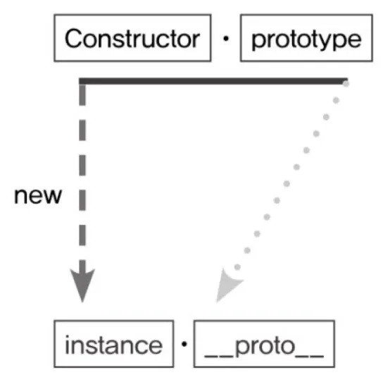

```jsx
var instance = new Constructor();
```

- 어떤 **생성자 함수**(`Constructor`)를 **new 연산자**와 함께 호출하면.
- `Constructor`에서 정의된 내용을 바탕으로 새로운 인스턴스가 생성된다.
- 이때 instance에는 `__proto__`라는 프로퍼티가 자동으로 부여되는데,
- 이 프로퍼티는 Constructor의 `prototype`이라는 프로퍼티를 참조한다.

<aside>
💡

`__proto__` 는 던더 프로토(dunder proto)라고 부른다

</aside>

- prototype이라는 프로퍼티와 **proto** 라는 프로퍼티, 이 둘의 관계가 프로토타입 개념의 핵심이다.
- prototype은 객체다. 이를 참조하는 **proto** 역시 객체다.
- prototype 객체 내부에는 인스턴스가 시용할 메서드를 저장한다. 그러면 인스턴스에서도 숨겨진 프로퍼티인 **proto** 를 통해 이 메서드들에 접근할 수 있게 된다.

---

```jsx
var Person = function (name) {
  this._name = name;
};

Person.prototype.getName = function () {
  return this._name;
};

var suzi = new Person("Suzi");
Person.prototype === suzi.__proto__; // true
```

- Person의 인스턴스는 **proto** 프로퍼티를 통해 getName을 호출할 수 있다.
- 인스턴스 suzi의 \***\*proto\*\***가 Constructor의 **prototype 프로퍼티를 참조**하므로 둘은 같은 객체를 바라보기 때문이다.

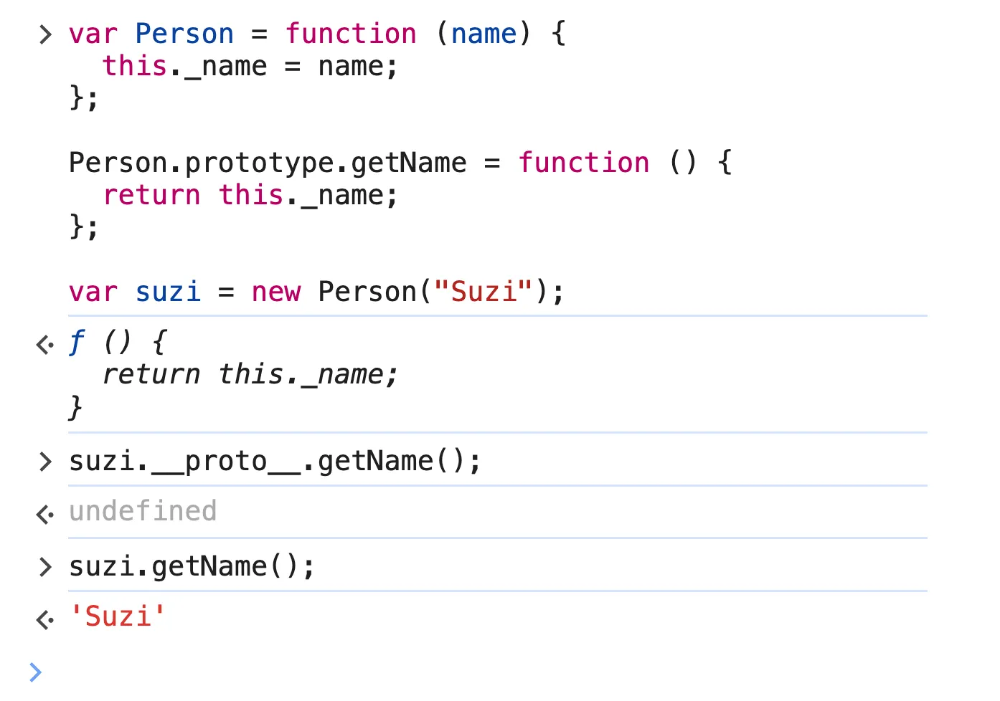

- `suzi.__proto__.getName();` 을 호출해 보면 **undefined**를 출력한다
  - 인스턴스를 생성할때 “Suzi”라는 매개변수를 넘겼는데 왜 `this.name`이 “Suzi”가 아닐까?
- 우선, 어떤 변수를 실행해 **undefined**가 나왔다는 것은 이 변수가 호출할 수 있는 함수라는 뜻이다.
  - 만약 실행할 수 없는, 즉 함수가 아닌 다른 데이터 타입이었다면 TypeError가 발생했을 것이다.
- 그래서 문제는 this에 바인딩된 대상이 잘못 지정됐다는 것이다.
  - `suzi.__proto__.getName();` 로 호출 시, getName 함수 내부에서의 this는 `suzi` 가 아니라 `suzi.__proto__` 가 된다.
- `suzi.__proto__` 에는 name 프로퍼티가 없으므로 **‘찾고자 하는 식별자가 정의돼 있지 않을 때는 Error 대신 undefined를 반환한다’**라는 자바스크립트 규약에 의해 undefined가 반환된 것이다.
- 그래서 `suzi.getName();` 을 하면 **this가 suzi 인스턴스**가 되므로 정상적인 값이 출력된다.

---

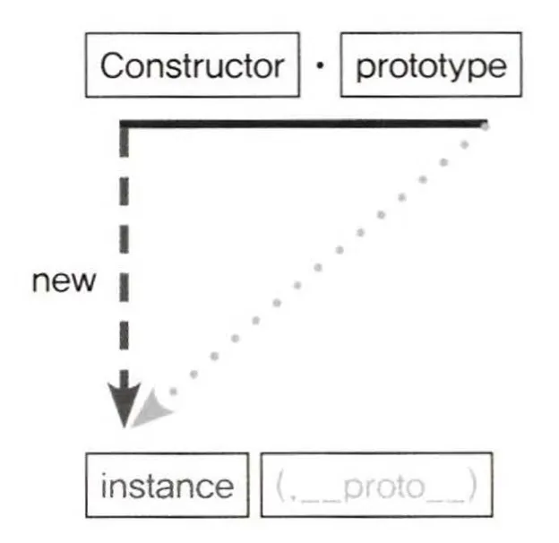

- **proto**는 생략 가능한 프로퍼티다. 원래부터 생략 가능하도록 정의돼 있다.
- 그렇기 때문에 suzi.**proto**에 있는 메서드인 getName을 실행하지만 this는 suzi를 바라보게 할 수 있게 된 것이다.
- 정리하자면 "new 연산자로 Constructor를 호출하면 instance가 만들어지고, instance의 생략 가능한 프 로퍼티인 **proto**는 Constructor의 prototype을 참조한다!”

**좀더 자세히 설명하자면,**

- JS는 함수에 자동으로 객체인 prototype 프로퍼티를 생성해 놓는다.
- 해당 함수를 생성자 함수로서 사용할 경우, 즉 new 연산자와 함께 함수를 호출할 경우,
- 그로부터 생성된 인스턴스에는 숨겨진 프로퍼티인 **proto**가 자동으로 생성되며, 이는 생성자 함수의 prototype을 참조한다.
- **proto**는 생략 가능하기 때문에 생성자 함수의 prototype에 어떤 메서드, 프로퍼티가 있다면 인스턴스에서도 자신의 것처럼 해당 메서드, 프로퍼티에 접근할 수 있게 된다.

---

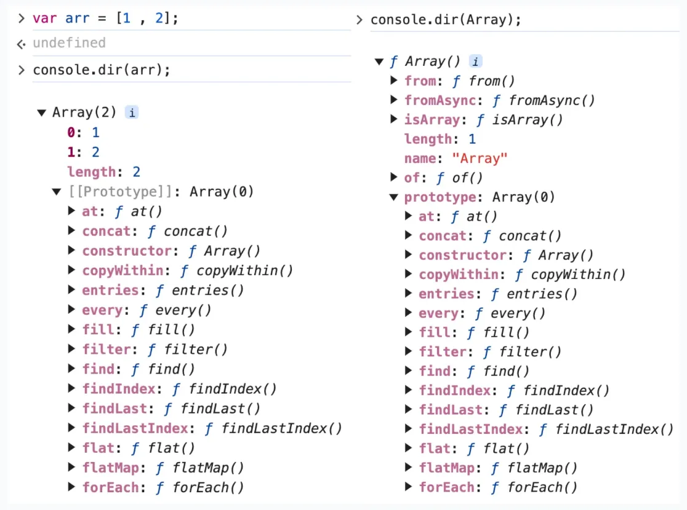

- 왼쪽은 arr 변수를 출력한 결과이고, 오른쪽은 생성자 함수 Array를 출력한 결과다.
- 왼쪽 arr 변수부터 살펴보자
  - Array(2)로 Array 생성자 함수를 원형으로 삼아 생성됐고, length가 2임을 알 수 있다.
  - **proto**(`[[Prototype]]`)를 열어보면 find, filter, forEach 등 우리가 배열에 사용하는 메서드들이 정의돼있다.
- 오른쪽 Array 생성자 함수를 살펴보자
  - 첫 줄에 함수라는 의미의 f가 표시돼 있고, 둘째 줄부터는 함수의 기본적인 프로퍼티들인 length, name 등이 있다.
  - 또한 Array 함수의 정적 메서드인 from, isArray, of 등도 보인다.
  - prototype을 열어보면 왼쪽 arr 변수와 완전히 동일한 내용으로 구성돼있다.

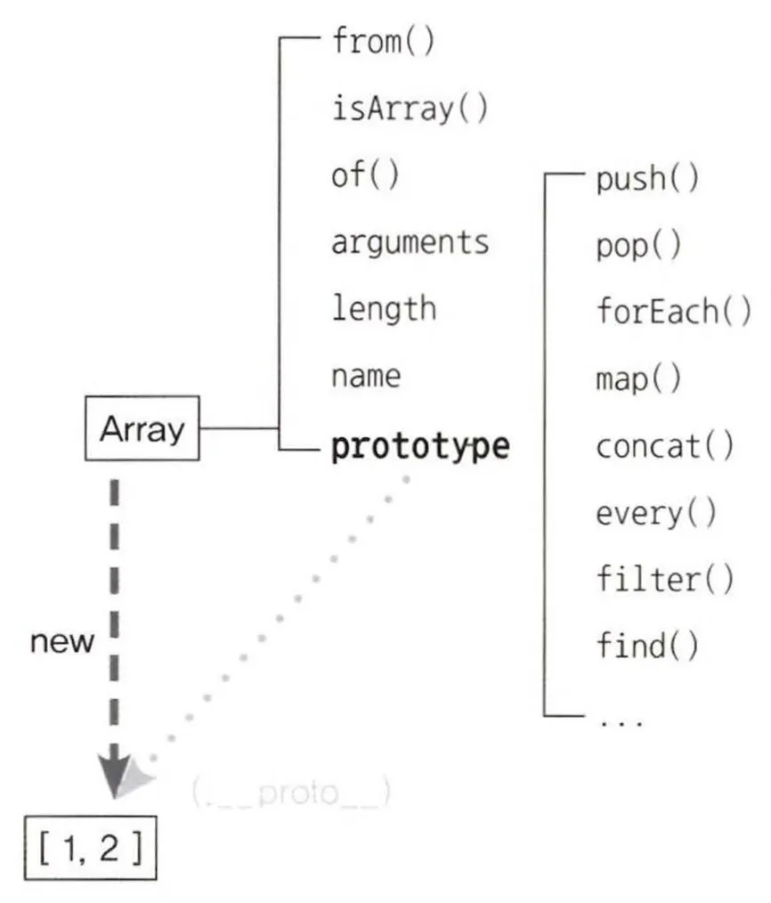

- 이처럼 배열 인스턴스를 생성하면, **proto**는 Array.prototype을 참조하고 있고
- **proto**는 생략 가능하기 때문에 인스턴스가 find, filter, forEach 등의 메서드를 자신의 것처럼 호출할 수 있다.

```jsx
var arr = [1, 2];

arr.forEach(function () {}); // (O)
Array.isArray(arr); // (O)

arr.isArray(); // (X) TypeError: arr.isArray is not a function
```

- 한편 Array의 prototype 프로퍼티 내부에 있지 않은 from, isArray 등의 메서드는 생성자 함수에서 직접 접근해야 실행 가능하다.

---

### constructor 프로퍼티

생성자 함수의 프로퍼티인 prototype 객체 내부에는 constructor 프로퍼티가 있다. 인스턴스의 **proto** 객체 내부에도 마찬가지다. 이 프로퍼티는 단어 그대로 원래의 생성자 함수(자기 자신)를 참조한다.

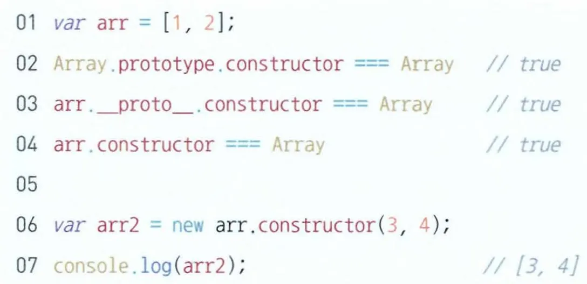

---

## 2. 프로토타입 체인

**인스턴스가 동일한 이름의 프로퍼티 또는 메서드를 가지고 있는 상황**

```jsx
var Person = function (name) {
  this.name = name;
};

Person.prototype.getName = function () {
  return this.name;
};

var iu = new Person("지금");

iu.getName = function () {
  return "바로" + this.name;
};

console.log(iu.getName()); // 바로 지금
```

- iu.**proto**.getName이 아닌 iu 객체에 있는 getName 메서드가 호출됐다.
- 이렇게 메서드 위에 **메서드가 덮어 씌워진 현상**을 **메서드 오버라이드**라고 한다.
- 원본은 없어지지 않고 그대로 있는 상태에서 다른 대상을 그 위에 얹는 방식으로 동작한다.
- JS 엔진이 getName 메서드를 찾는 방식을 알아보자면
  1. 자신의 프로퍼티를 getName을 검색한다.
  2. 없으면 그 다음으로 가까운 대상인 **proto**에서 getName을 검색한다.
- 결국 getName()의 결과가 “바로 지금”인 이유는 `iu.__proto__.getName`가 `iu.getName()` 에게 검색 순서에서 밀려 호출되지 않은 것이다.

---

```jsx
console.dir({ a: 1 });
```

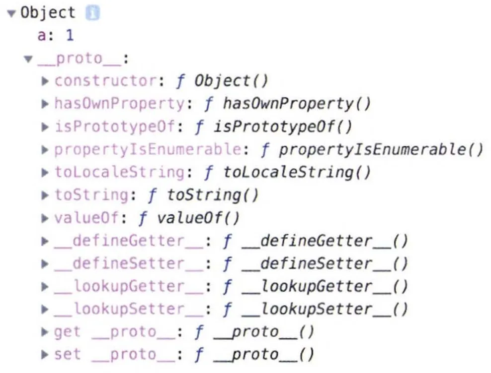

- 프로토타입 체인을 설명하기 전에 우선 객체의 내부 구조를 살펴보자.
- 첫 줄을 통해 Object의 인스턴스임을 알 수 있고, 프로퍼티 a의 값 1, **proto** 내부에는hasOwnProperty, toString, valueOf 등의 메서드가 보인다.
- constructor는 생성자 함수인 Object를 가리키고 있다.

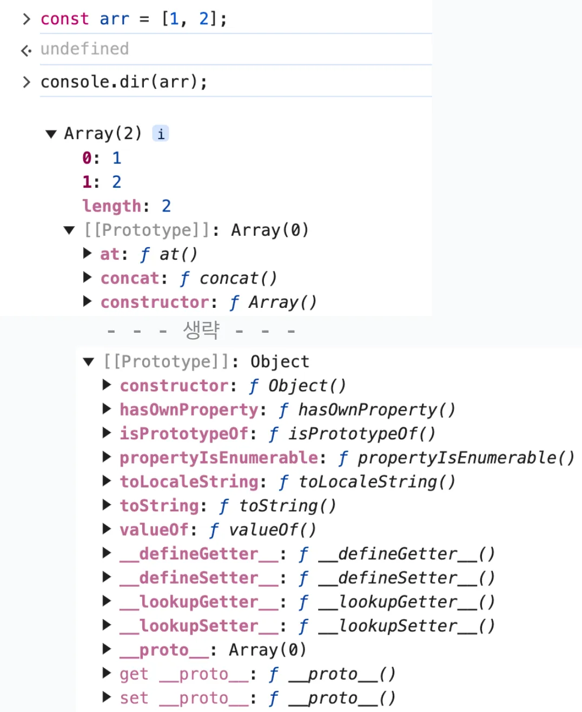

- 다시 아까 살펴본 배열 리터럴의 구조를 보면 **proto**(`[[Prototype]]`) 안에 또 다시 **proto**가 등장하고, 위에서 본 객체의 **proto**와 동일한 내용으로 이뤄져 있다.
- 그 이유는 prototype 객체도 결국 **‘객체’**이기 때문이다.
- 기본적으로 모든 객체의 **proto**에는 **Object.prototype**이 연결되는데 그림으로 보면 다음과 같다.

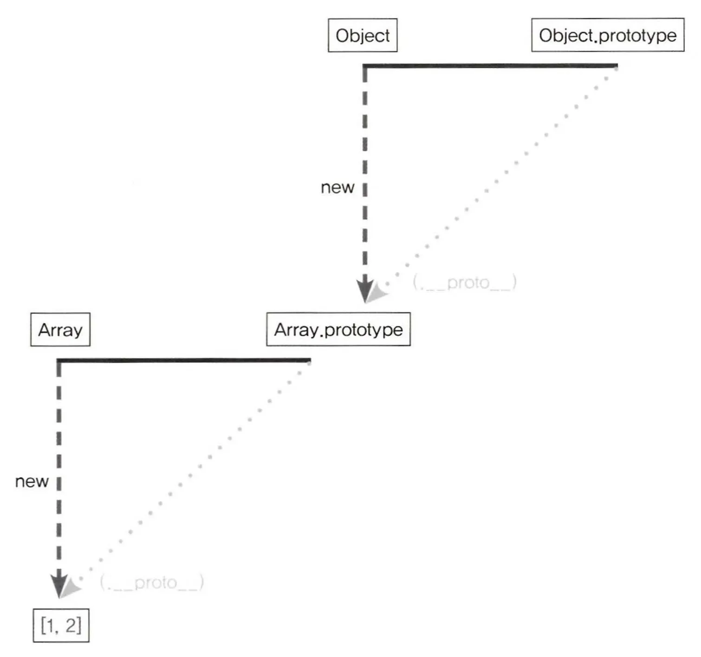

- **proto**는 생략 가능하다. 그래서 배열이 메서드를 자신의 것처럼 실행할 수 있다.

```jsx
// (.__proto__.)를 타고 연결됨
var arr = [1, 2];

arr(.__proto__.).push(3); // Array 메서드
arr(.__proto__.)(.__proto__.).hasOwnProperty(2); // true (Object 메서드)
```

- 마찬가지로 **proto**를 한 번 더 따라가면 참조가 가능하므로 Object.prototype 내부의 메서드도 자신의 것처럼 실행할 수 있다.

이렇게 어떤 데이터의 **proto** 프로퍼티 내부에 다시 **proto**가 연쇄적으로 이어진 것을 **‘프로토타입 체인’** 이라고 하며, 이 체인을 따라가며 검색하는 것을 **‘프로토타입 체이닝’** 이라고 한다.

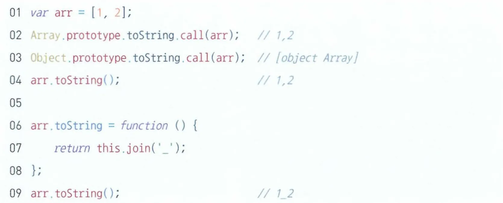

- 위 예제의 라인 2, 3에서 각각 배열, 객체의 toString 메서드 결과값을 확인하고, 라인 4에서 toString을 호출하니 Array의 toString 결과가 출력된다.
- 라인 6에서는 직접 arr.toString으로 메서드를 부여하고 라인 9의 결과값도 직접 부여한 메서드 결과가 나온다.

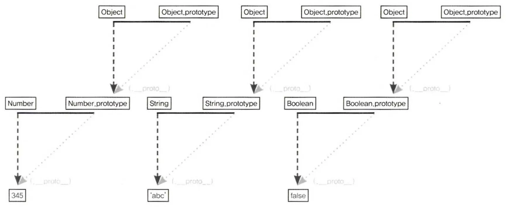

- 이렇게 배열 뿐만 아니라 모든 데이터 타입은 동일한 형태의 프로토타입 구조를 가진다.
- 결국 프로토타입 체인을 통해 위쪽 삼각형의 우측 꼭짓점에는 무조건 Object.prototype이 있게 된다.

---

이렇게 책을 통해 자바스크립트의 근간이 되는 프로토타입 개념에 대해서 살펴봤다. 저 자세한 내용은 ‘코어 자바스크립트’ 도서에 나와있으니 JS에 대해 깊게 알고 싶은 개발자라면 읽어보는 것을 추천한다
